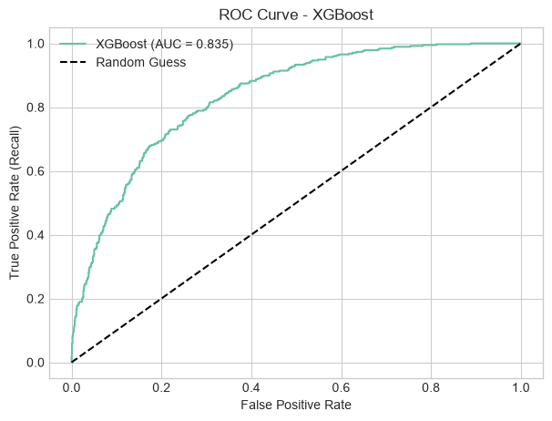
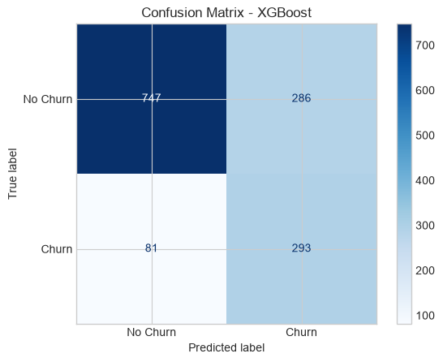
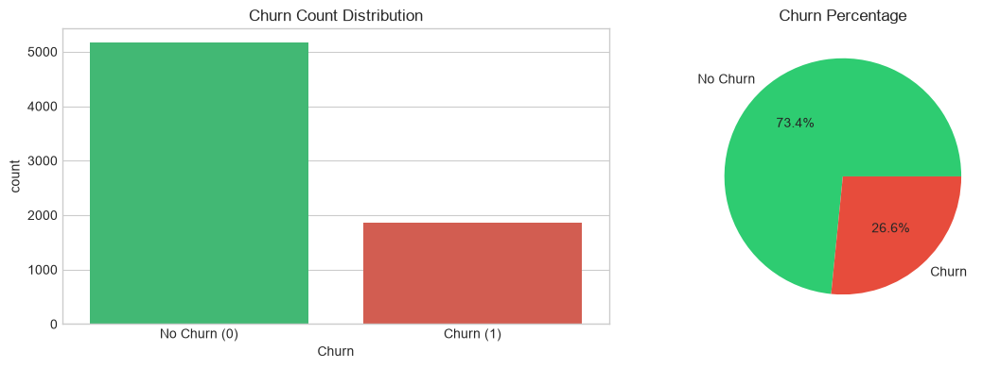
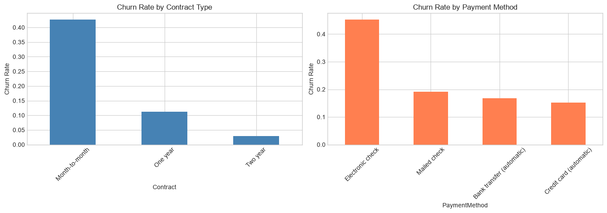
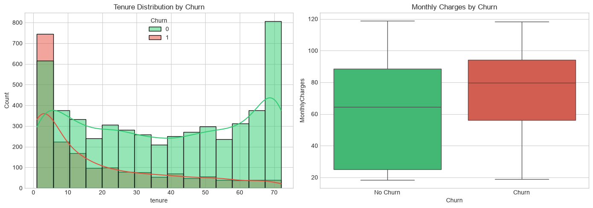
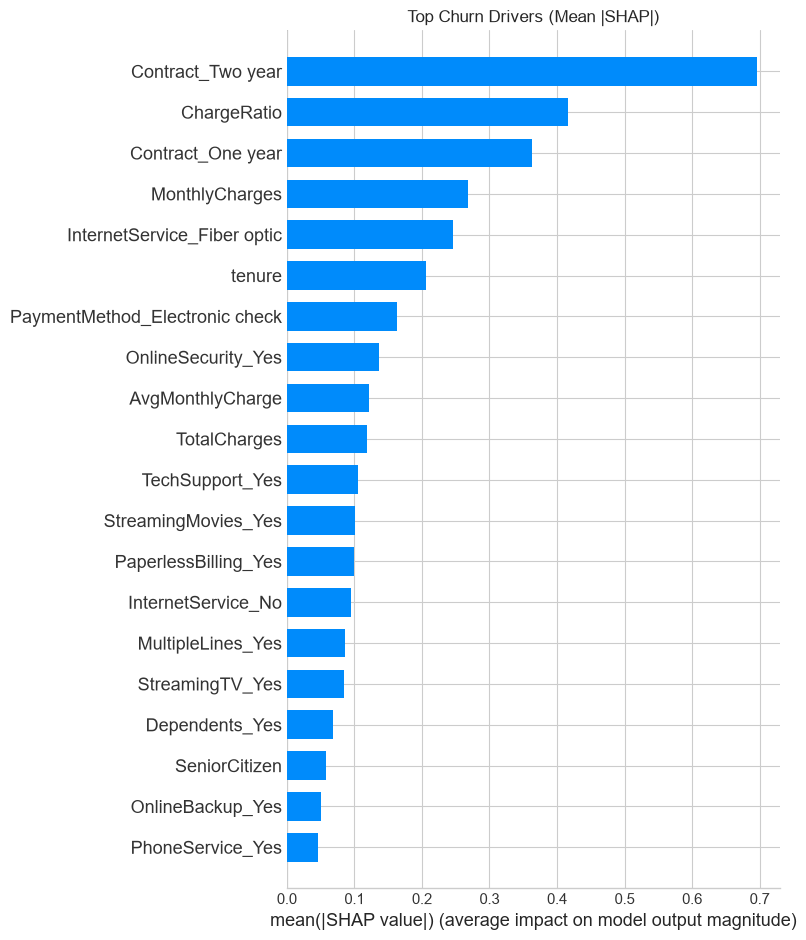
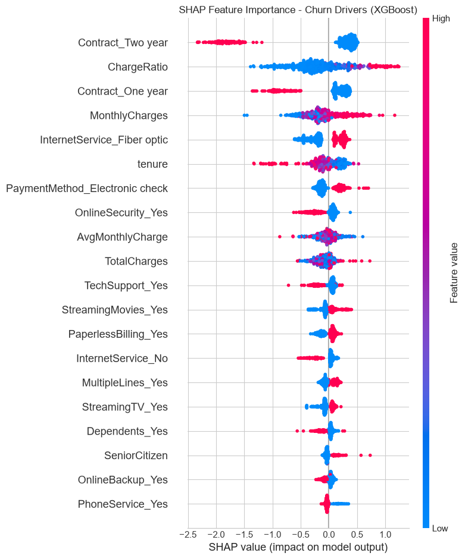

# Telco Customer Churn Prediction

End-to-end classification project that predicts which telecom customers are likely to leave, using the public [Telco Customer Churn](https://www.kaggle.com/datasets/blastchar/telco-customer-churn) dataset.

**Best model: XGBoost · ROC-AUC 0.835 · 78% of churners caught on a held-out test set**

The notebook covers cleaning, EDA, feature engineering, class-imbalance handling, model comparison, and SHAP explanations of what actually drives churn.

---

## Results at a glance

| Model | ROC-AUC | Accuracy | Churn recall | Churn precision | Churn F1 |
| --- | ---: | ---: | ---: | ---: | ---: |
| **XGBoost** | **0.835** | 0.74 | **0.78** | 0.51 | 0.61 |
| Random Forest | 0.834 | 0.75 | 0.78 | 0.52 | 0.62 |
| Logistic Regression (baseline) | 0.827 | 0.75 | 0.72 | 0.52 | 0.61 |

Test set: **1,407 customers**, stratified 80/20 split (churn rate held at 26.6%).

Churn **recall** is the business metric here: it is the share of customers who actually left that the model still flagged in time for a retention offer. XGBoost and Random Forest both catch **78%** of churners. Precision of ~51% means about half of flagged customers are true churners — a typical trade-off when the goal is not to miss people who will leave.

<p align="center">
  
  
</p>

<p align="center"><em>XGBoost on the test set: ROC curve (left) and confusion matrix (right).</em></p>

---

## Business problem

About **1 in 4** customers in this dataset churn. Replacing them is expensive, so the useful question is: *who is at risk, and why?*

The model is built as a ranking tool for retention campaigns: prioritize month-to-month, high-charge, short-tenure customers before they leave.

---

## Dataset

| | |
| --- | --- |
| **Source** | Kaggle — Blastchar Telco Customer Churn |
| **File** | `WA_Fn-UseC_-Telco-Customer-Churn.csv` |
| **Size** | 7,043 customers × 21 columns (7,032 after dropping 11 blank `TotalCharges` rows) |
| **Target** | `Churn` — Yes 26.5% / No 73.5% |

Features cover demographics, services, contract type, billing, tenure, and monthly/total charges.

<p align="center">
  
</p>

<p align="center"><em>Class imbalance: 73.5% stay vs 26.5% churn — handled later with a stratified split, SMOTE, and class weights.</em></p>

---

## What the data shows

Churn is concentrated in a few segments, not spread evenly:

- **Month-to-month** contracts churn at **42.7%**, vs **11.3%** on one-year and **2.8%** on two-year plans.
- **Electronic check** payers churn at **45.3%**, vs ~15–19% on automatic payments.
- **Fiber optic** customers churn at **41.9%**, vs **19.0%** on DSL and **7.4%** with no internet.
- Risk is highest early: short **tenure** plus high **monthly charges** line up with leaving.

<p align="center">
  
</p>

<p align="center"><em>Churn rate by contract (left) and payment method (right).</em></p>

<p align="center">
  
</p>

<p align="center"><em>New, high-bill customers leave more often; longer tenure is protective.</em></p>

---

## Approach

1. **Cleaning** — Convert `TotalCharges` to numeric, drop 11 missing rows (new customers with tenure 0), drop `customerID`, encode the target.
2. **Features** — `ChargeRatio` and `AvgMonthlyCharge`; one-hot encoding for categoricals; `StandardScaler` on numerics (32 features after encoding).
3. **Split & imbalance** — Stratified 80/20 split (5,625 / 1,407). SMOTE on training only (1,495 → 4,130 churn examples). Tree models also use `class_weight` / `scale_pos_weight`.
4. **Models** — Logistic Regression (interpretable baseline), Random Forest, XGBoost.
5. **Evaluation** — Confusion matrix, precision/recall/F1, ROC-AUC, and SHAP on XGBoost.

---

## What drives churn (SHAP)

SHAP on the XGBoost model lines up with the EDA: contract type, tenure, and charges dominate the prediction.

<p align="center">
  
</p>

<p align="center"><em>Mean |SHAP|: which features move the churn score the most.</em></p>

<p align="center">
  
</p>

<p align="center"><em>Beeswarm: red = high feature value. Month-to-month contracts, low tenure, and higher charges push the score toward churn.</em></p>

**Takeaway for a retention team:** lock in longer contracts, watch electronic-check and fiber customers with high bills and short tenure, and spend outreach budget on that slice first.

---

## How to run

```bash
pip install pandas numpy matplotlib seaborn scikit-learn imbalanced-learn xgboost shap
```

Open `Telco_Customer_Churn_Prediction.ipynb` in Jupyter and run all cells. Keep the CSV in the same folder as the notebook.

---

## Tech stack

Python · Jupyter · pandas · NumPy · Matplotlib · Seaborn · scikit-learn · imbalanced-learn (SMOTE) · XGBoost · SHAP
